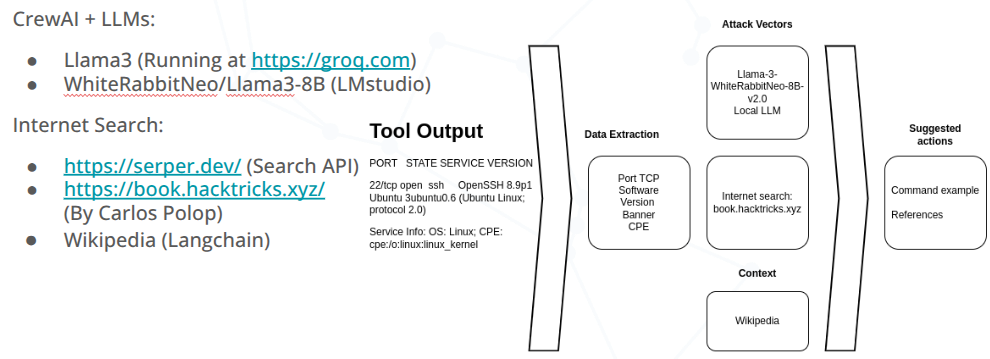

# Attack_advisor
This is is a PoC that suggest potential attack vectors that can be carried out against a specific server identfied by fingerprinting a remote target, using Nmap .nmap file as input, and querying specific relevant of the Internet.

Attack advisor, a tool based on AI Agents (CrewAI). 

Requirents:
- Groq API
- Serper API
- CrewAI
- Langchain_community
- A local LLM running on LMstudio (http://localhost:1234/v1) 

The examples were created with the LLM model: "mradermacher/Llama-3-WhiteRabbitNeo-8B-v2.0-GGUF".

This tools was a PoC created fro the talk "Explore Open-Source LLMs implementations and use cases for offensive security" at CRESTCon Europe 2024 in London.

### Whatch the video here: 

### Acknowledges

Carlos Polop - @carlospolop for creating and maintaining 
https://book.hacktricks.xyz/ 